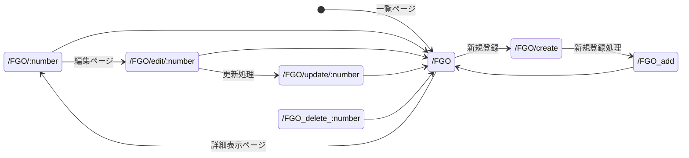

```mermaid
stateDiagram-v2
direction LR

state "/FGO/:number" as detail
state "/FGO/edit/:number" as edit
state "/FGO/update/:number" as update
state "/FGO/create" as create
state "/FGO_delete_:number" as delete


[*] --> /FGO:一覧ページ
/FGO --> detail:詳細表示ページ
detail --> edit:編集ページ
edit --> update:更新処理

detail --> /FGO
edit --> /FGO
update --> /FGO

/FGO --> create:新規登録
create --> /FGO_add:新規登録処理
/FGO_add --> /FGO

delete --> /FGO


```