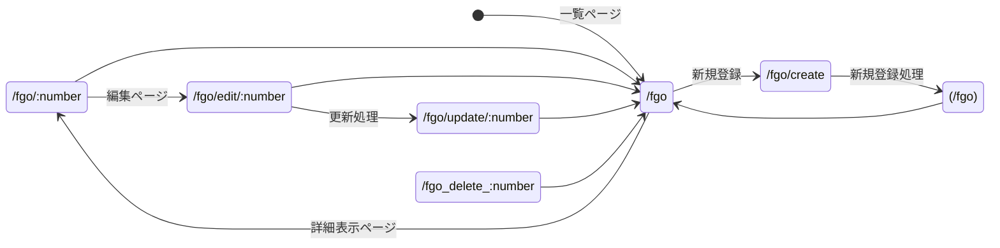
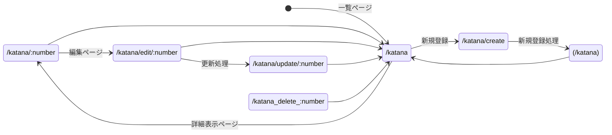
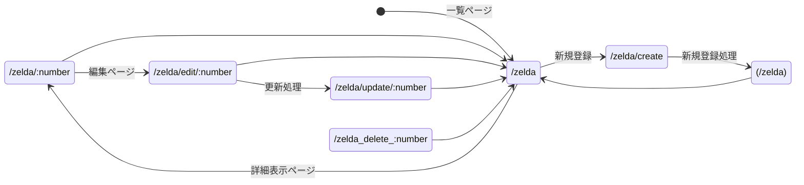

# レポート

## システム案
* FGO鯖
* 刀剣乱舞
* ワートリ部隊

## ページ遷移
1. FGO
ID、鯖番号、名前
名前→ステータス、実装日、キャラ画像

2. 刀剣乱舞
本丸内での役割一覧
ID、刀帳番号、名前
名前→ステータス、実装日、キャラ画像

3. ゼルダ対応機種システム
ID、タイトル、対応機種
ゲーム名→あらすじ、発売日

## スキーマ
1. FGO

| 項目名 | 型 | 内容 |
| ---- | ---- | ---- |
| code | 数値 | 鯖ID |
|name|文字列|鯖名|
|class|文字列|クラス|
|attribute|文字列|副属性(地天人)|
|policy|文字列|属性(秩序中立混沌)|
|trait|文字列|特性(善中庸悪)|

| 機能 | メソッド | リソース |　処理内容 |
| ---- | ---- | ---- | ---- |
| 一覧表示 | GET | /fgo | キャラの名前一覧を表示する |
| 新規登録　| POST | /fgo/creat | 新規キャラの登録 |
| 詳細表示 | GET | /fgo/:number | キャラ詳細画面の表示 |
| 編集 | GET | /fgo/edit/number | 登録済データの編集 |
| 更新処理 | POST | /fgo/update/:number | 編集データの処理 |
| 削除 | DELETE | /fgo/delete/:number | データの削除 |

2. 刀剣乱舞

| 項目名 | 型 | 内容 |
| ---- | ---- | ---- |
| ID | 数値 | 刀剣ID |
|name|文字列|刀剣男士名|
|job|文字列|本丸内での仕事|
|family|文字列|刀種|
|page|文字列|公式紹介ページ|
|song|文字列|キャラソンURL|

| 機能 | メソッド | リソース |　処理内容 |
| ---- | ---- | ---- | ---- |
| 一覧表示 | GET | /fgo | キャラの名前一覧を表示する |
| 新規登録　| POST | /fgo/creat | 新規キャラの登録 |
| 詳細表示 | GET | /fgo/:number | キャラ詳細画面の表示 |
| 編集 | GET | /fgo/edit/number | 登録済データの編集 |
| 更新処理 | POST | /fgo/update/:number | 編集データの処理 |
| 削除 | DELETE | /fgo/delete/:number | データの削除 |

1. ゼルダの対応機種

| 項目名 | 型 | 内容 |
| ---- | ---- | ---- |
| ID | 数値 | ID |
|name|文字列|ゲームタイトル|
|date|文字列|発売日|
|model|文字列|ゲーム機種|

| 機能 | メソッド | リソース |　処理内容 |
| ---- | ---- | ---- | ---- |
| 一覧表示 | GET | /fgo | ゲームの名前一覧を表示する |
| 新規登録　| POST | /fgo/creat | 新規ゲームの登録 |
| 詳細表示 | GET | /fgo/:number | ゲーム詳細画面の表示 |
| 編集 | GET | /fgo/edit/number | 登録済データの編集 |
| 更新処理 | POST | /fgo/update/:number | 編集データの処理 |
| 削除 | DELETE | /fgo/delete/:number | データの削除 |

